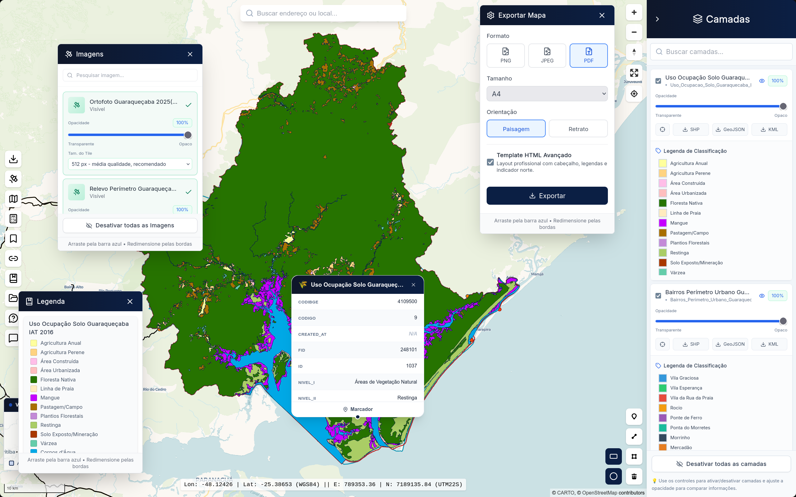

<h1 align="center"> WebGIS Guaraqueçaba - Cidade Inteligente 🌍 </h1>

  <i>Sistema WebGIS desenvolvido para visualização e consulta de dados territoriais do município de Guaraqueçaba-PR.</i>

---

## 📖 Sobre o Projeto

Desenvolvido pelo **Laboratório de Planejamento Urbano e Regional (LABPLAN | UEPG)**, o WebGIS Guaraqueçaba faz parte das iniciativas de Cidades Inteligentes da região. O sistema oferece uma plataforma web interativa para a gestão territorial, facilitando a tomada de decisão por gestores públicos, pesquisadores e a população local através da espacialização de dados urbanos e ambientais.

## 🚀 Acesse a Plataforma

🌐 **Link oficial:** [https://webgis.uepg.br/guaraquecaba/](https://webgis.uepg.br/guaraquecaba/)
🌐 **Outros WebGIS:** [https://webgis.uepg.br](https://webgis.uepg.br)

---

## ✨ Funcionalidades

O sistema foi desenhado para ser completo e intuitivo, oferecendo diversas ferramentas cartográficas:

**🗺️ Visualização e Exploração**
- Visualização de camadas geográficas de **Dados Ambientais** e **Dados Urbanos**.
- Visualização de ortofotos de alta resolução.
- Alternância entre diferentes Estilos de Mapas (Basemaps).
- Consulta espacial de atributos direto no mapa.

**🛠️ Ferramentas Interativas**
- Upload de arquivos `GeoJSON` para visualização e cruzamento de dados temporários do usuário.
- Conversor de coordenadas integrado.
- Conjunto completo de ferramentas cartográficas (medição de área/distância, zoom, etc.).

**📥 Exportação e Download**
- Download de camadas geográficas nos formatos padrão de mercado: `ShapeFile`, `KML` e `GeoJSON`.
- Exportação de layout do Mapa (para impressão ou relatórios) em `PDF`, `PNG` e `JPEG`.

---

## 💻 Tecnologias Utilizadas

O projeto foi construído utilizando uma arquitetura moderna baseada em tecnologias consolidadas de desenvolvimento web e geoprocessamento open-source:

### Frontend
- 
- 
-  

### Bibliotecas de Mapas
- **Leaflet** e **MapLibre GL** (Renderização e interatividade espacial)

### Backend e Dados Geográficos
- 
- **GeoServer** (Servidor de mapas e publicação de serviços OGC)
-  com **PostGIS** (Armazenamento de dados relacionais e espaciais)

### Infraestrutura
-  (Conteinerização dos serviços)

---
## 👨‍💻 Desenvolvimento

A arquitetura, engenharia de software e implementação de todo o sistema foram realizadas por:

* **Vitor Cristian da Veiga** - *Desenvolvedor Full Stack / Especialista GIS* 
  

---

## 🏛️ Realização / Institucional

* **LABPLAN** - Laboratório de Planejamento Urbano e Regional
* **UEPG** - Universidade Estadual de Ponta Grossa

  Desenvolvido no Paraná, Brasil. 📍

